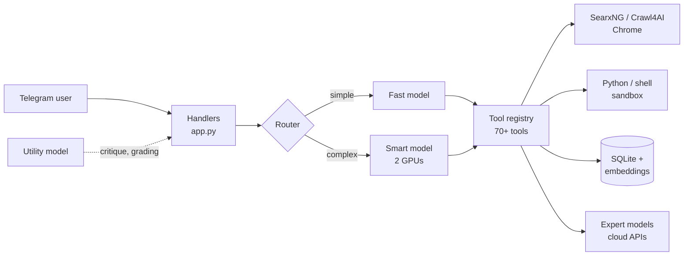

# Self-Hosted AI Assistant

[](https://github.com/Edgars-Projects/self-hosted-ai-assistant/actions/workflows/ci.yml)


An agentic AI assistant you talk to through Telegram. It runs open-source language models locally with [Ollama](https://ollama.com), uses more than 70 tools, remembers context between conversations and can work on scheduled tasks by itself.

It installs its own dependencies and runs on Kaggle, Google Colab or any Linux machine with an NVIDIA GPU.

## Features

- **Two-tier model routing:** a fast 14B model answers simple messages; a 30B+ model split across two GPUs handles harder reasoning. Routing is deliberately sticky, because swapping models costs 30–60 seconds.
- **Tool use:** self-hosted web search (SearxNG), clean page extraction (Crawl4AI), headless Chrome, Python and shell execution, background jobs, Git, HTTP and file delivery.
- **Long-term memory:** SQLite storage plus embedding-based semantic search, and a document library for asking questions about your own files.
- **Voice and vision:** transcribes voice notes with Whisper, can reply with speech, and describes photos with a vision model.
- **Automation:** cron-style scheduled prompts, page-change watchers and webhooks.
- **Documents:** generates PDF and Excel files and sends them as Telegram attachments.
- **Expert consultation:** can ask cloud models (OpenRouter, Groq, Cerebras, Gemini) for hard problems, falling back automatically between providers, and cross-checks high-stakes answers with two independent models.
- **Bounded self-improvement:** learned behaviour rules are capped, versioned and reversible, with rollback for failed tool changes.
- **One-file state:** `/backup` sends the database to you; send it back to restore.

## Architecture



## Project structure

```
src/assistant/
├── app.py            # bootstrap, agent loop, tool dispatch, Telegram handlers
├── config.py         # all tunable settings and model choices
├── persona.py        # system prompt and tool-use rules
├── installers.py     # idempotent installers for Ollama, SearxNG, Crawl4AI, Chrome
├── db.py             # SQLite schema and the thread-safe Store
├── secrets.py        # secret lookup: env vars, Kaggle, Colab
├── util.py           # shared helpers (output clipping)
└── tools/
    ├── memory.py     # remember / recall / forget
    ├── mail.py       # disposable inbox and SMTP sending
    ├── documents.py  # PDF and Excel generation
    ├── crypto.py     # read-only price and wallet lookups
    └── clock.py      # current time
tests/
├── test_*.py         # unit tests (no GPU or network needed)
└── integration/      # end-to-end tests with fake Telegram and Ollama
run.py                # run without installing (Kaggle/Colab)
```

## Quick start

1. Create a bot with [@BotFather](https://t.me/BotFather) and copy the token.
2. Provide it as `TELEGRAM_TOKEN`:
   - **Linux:** `export TELEGRAM_TOKEN=...`
   - **Kaggle:** Add-ons → Secrets
   - **Colab:** the key icon in the sidebar
3. Optionally add expert provider keys (see `.env.example`).
4. Run:
   ```bash
   git clone https://github.com/Edgars-Projects/self-hosted-ai-assistant.git
   cd self-hosted-ai-assistant
   python run.py
   ```
   The first run installs Ollama, pulls models and starts services, which takes a while.
5. **Message your bot immediately.** The first chat to message it becomes the owner; everyone else is blocked unless added to `allowed_chats.json`.

## Commands

| Command | Purpose |
|---|---|
| `/help` | List commands |
| `/model` | Switch routing: `fast`, `smart` or `auto` |
| `/voice` | Toggle spoken replies |
| `/backup` | Send the state database |
| `/stats` `/health` | Usage stats and service health |
| `/goals` `/idle` | List goals; toggle self-directed work |
| `/rules` `/reflect` | List learned rules; run a reflection pass |
| `/good` `/bad` | Rate the last answer |
| `/reset` `/wipe` | Clear the conversation; wipe this chat's memory too |

## Configuration

All settings live in [`src/assistant/config.py`](src/assistant/config.py). Model choices are ordered lists of Ollama tags; the first one that installs wins. Swap in any tag from [ollama.com/search](https://ollama.com/search). Set `BOT_STATE` to change where state is stored.

## Development

```bash
pip install -e ".[dev]"
ruff check . && ruff format --check .   # lint and formatting
mypy                                    # type checking
pytest                                  # unit + end-to-end tests
```

### How it is tested

- **Unit tests** cover the database store, output clipping, secrets, installers and every extracted tool, with network calls mocked.
- **End-to-end tests** start the real `main()` with only the network edges faked: a scripted stand-in for the Ollama API and a local stand-in for Telegram's HTTP API. Real handlers, the agent loop, tool dispatch and SQLite all run, and the tests assert on what the bot actually sends: replies, tool results, memory round trips, generated files and that strangers are ignored.
- When the code was restructured, the same harness was run against the original single-file script and produced identical transcripts.

CI runs linting, formatting, type checks and both test suites on Python 3.10–3.12.

## Security

- The assistant executes shell commands and Python, so run it only in a disposable container, notebook or VM.
- Secrets are read from the environment and stripped from the environment that tools run in.
- Never commit `.env`, `allowed_chats.json` or database files; `.gitignore` excludes them.

## Design decisions

- **Sticky routing over per-message routing:** only one large model fits in GPU memory at a time, and thrashing between models was slower than using either alone.
- **A tiny utility model for internal checks:** critique and grading ran at 30–60s on the main model; a 4B model does them in about a second.
- **`pip --target` instead of virtual environments:** Kaggle's environment breaks `ensurepip`, and isolated targets avoid conflicts with hundreds of preinstalled packages.
- **Tool output is never silently truncated:** truncated results tell the model exactly how to fetch the rest, which reduced invented answers.
- **Tools report failures instead of raising:** a tool that crashes would end the agent's turn, so tool boundaries deliberately catch errors and return them as text the model can act on. Elsewhere, handlers catch specific exceptions.
- **Dependencies are passed in, not reached for:** extracted tools receive a `Store` or callable explicitly, so they can be tested without starting the bot.

## Roadmap

- [x] Package structure, CI, linting and type checking
- [x] End-to-end tests with fake Telegram and Ollama
- [x] Memory, mail, document, crypto and clock tools extracted into `tools/`
- [ ] Extract the remaining tools (web, browser, shell, scheduling, experts) from `app.py`
- [ ] Extend type hints to `app.py`
- [ ] Docker image for local deployment

## Author

Built by Edgar.

## License

[MIT](LICENSE)
